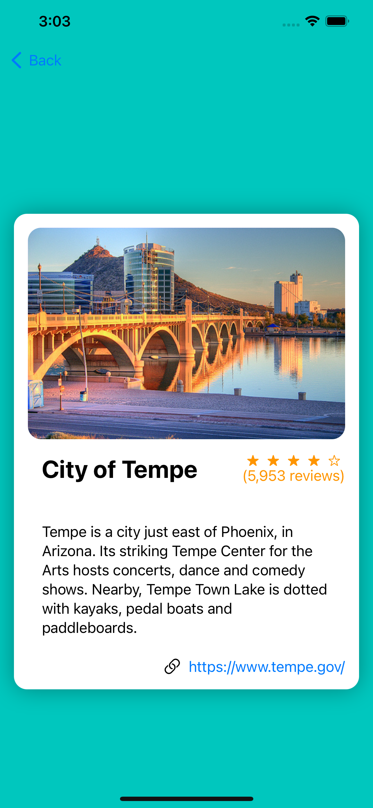
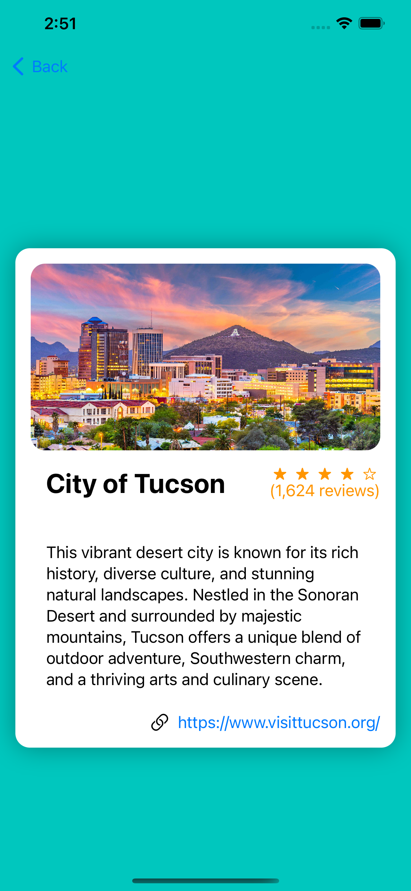

# Cities in Arizona Cue Card App

This is a simplistic iOS application made using SwiftUI and XCode that displays information about four major Arizona Cities.

Here are a few screenshots from the app:

  
  
  
  

